# 🏨 Hotel Management System

## 📄 Overview
This is a minimal Hotel Management App which handles basic operations in a small Hotel. It allows the authorized staff to manage rooms, customers, bookings and bill receipts all in one app.

This was designed with a focus on clean UI, normalized database design, and robust validation.


## 📸 Screenshots
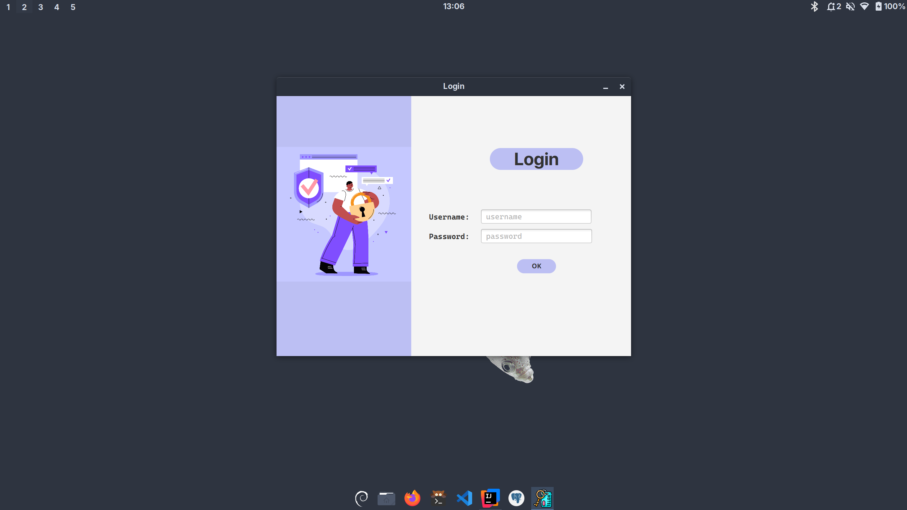
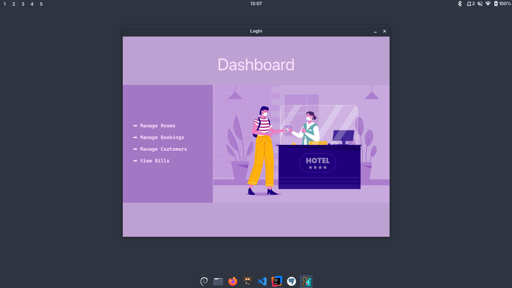
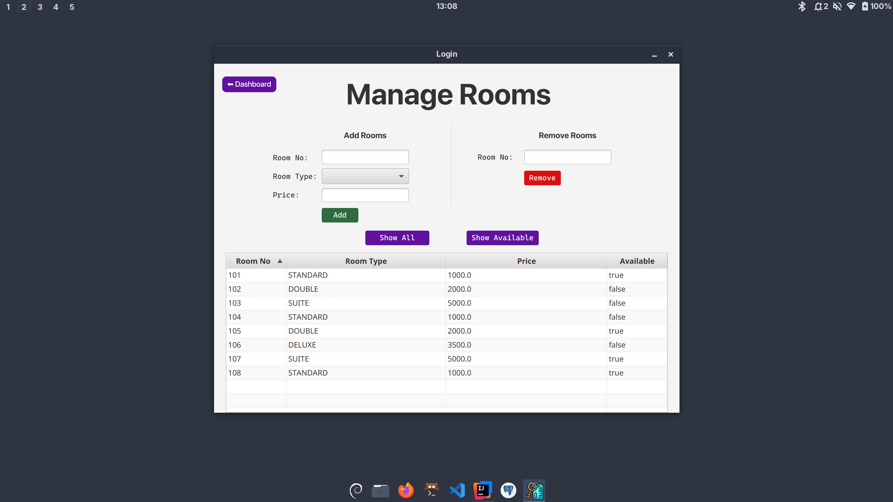
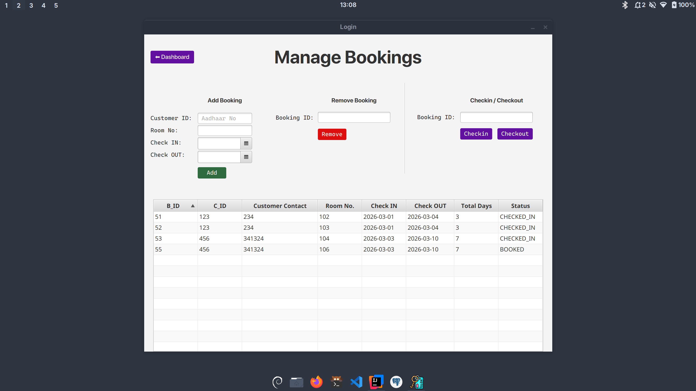
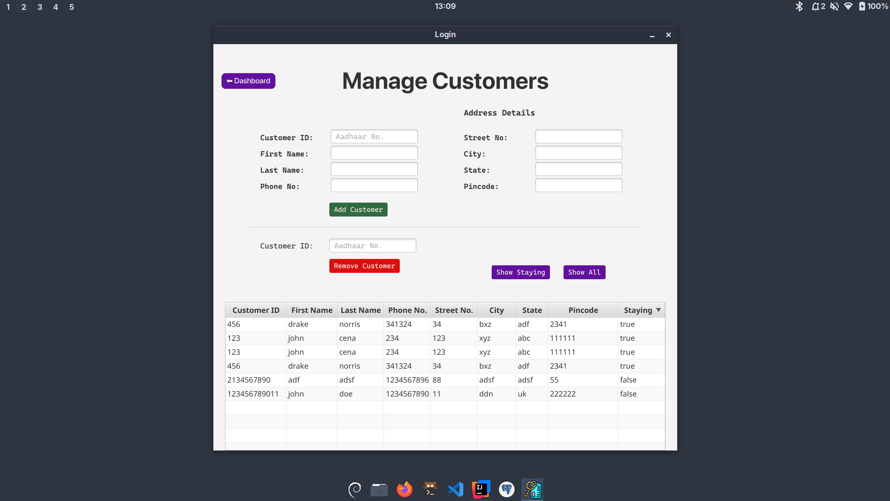
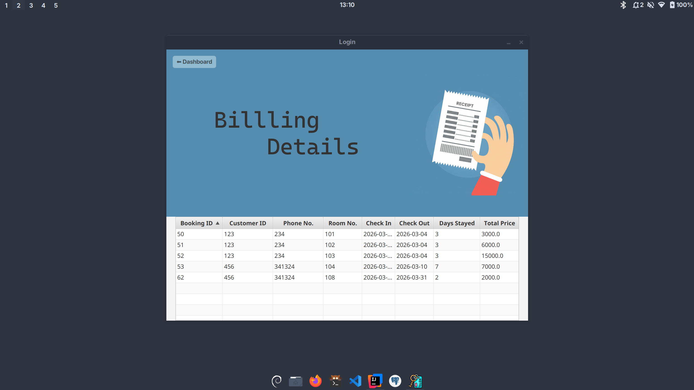


## 💡 Features
- Customer registration and update confirmation
- Room booking & availability tracking
- Check-in / Check-out system
- Billing and payment handling
- Input validation & error handling
- Secure password storage (hashed)
- Structured relational database


## 🛠️ Tech Stack
| Layer       | Technology   |
|-------------|--------------|
| Frontend	   | JavaFX       |
| Backend	    | JDBC         |
| Database	   | PostgreSQL   |
| Styling	    | CSS (JavaFX) |
| Build Tool	 | Maven        |


## 🗂️ Project structure
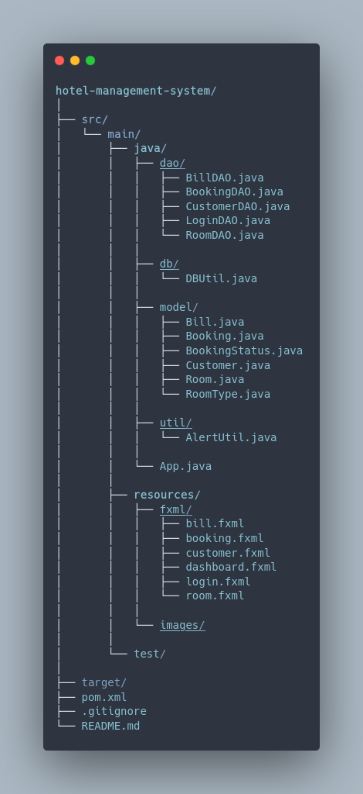


## 🗄️ Database Schema
### Key Tables
- login
- room
- customer
- booking
- bill

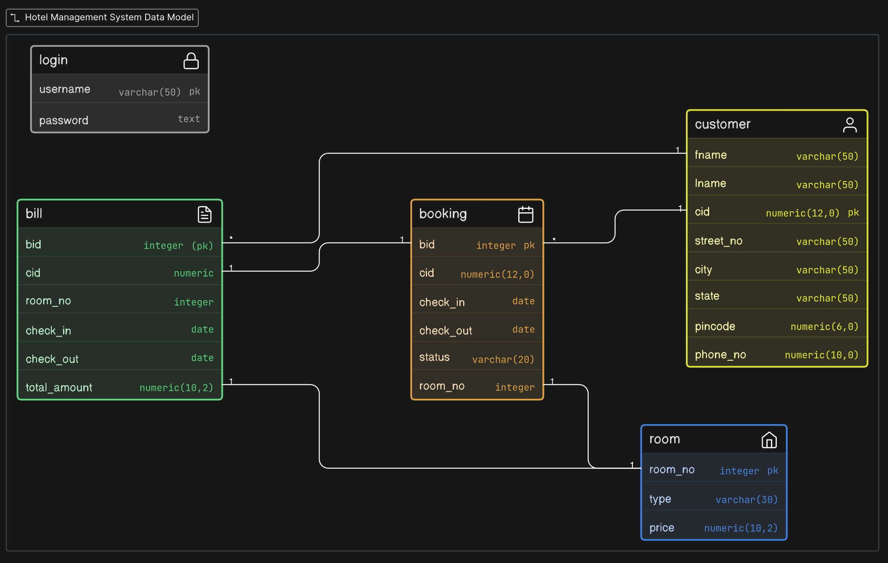

### Extensions
- `pgcrypto`: To store passwords as hashes using the `bcrypt` algorithm

### Triggers and functions
- #### Auto Bill Generation on Check-in
  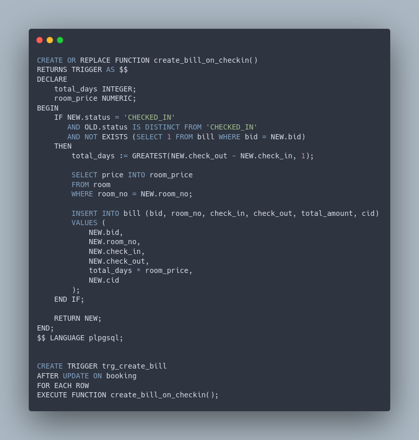

- #### Auto Delete Booking when Checked-out
  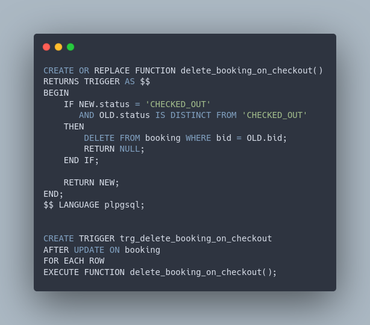

- #### Automatically hash password when inserting into `login` table
  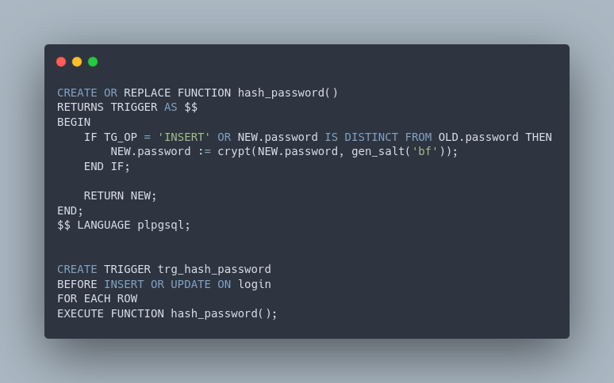


## 🖥️ Application Scenes (UI)
- login
- dashboard
- rooms
- customers
- bookings
- bills

Each scene is handled using JavaFX controllers + FXML separation.


## ⚠️ Exception Handling
- Validate Login
- Empty input fields validation
- Invalid numeric/date formats
- Duplicate entries (handled via DB constraints)
- Room double-booking prevention
- Invalid check-in/check-out dates
- Database exception handling (e.g., unique constraint violations)


---
## 🚀 How to Run
- Clone the repository
```
git clone https://github.com/prat-07/hotel-management-system-dbs.git
```

- Setup PostgreSQL

- Run the `setup.sql` file in the `assets` folder to create the exact same database.

- Configure DB connection in Java (`DBUtil.java` under the `db` package)
```
url = "jdbc:postgresql://localhost:5432/hotel_management_system";
user = "your_user";
password = "your_password";
```
- Run the project using the following command:
```
mvn javafx:run
```
**Note: you might need to set up `maven` in your machine or use `IntelliJ Idea`.**

---

## 🔐 Security Notes
- Passwords stored using hashing (`bcrypt` algorithm) technique
- Input validation both at UI and DB level
- SQL injection avoided using prepared statements


## 🚫 Limitations
- Can't validate payment.
- No staff entries.
- The system currently allows a single customer to book multiple rooms without limitation. This creates a vulnerability where one user can monopolize room availability without checking in, effectively causing a denial of service for legitimate users.

## 🍀 Future Improvements
- UI to add/remove authorized staff.
- Hotel Staffs with their duties (e.g. housekeeping, bellhop, drivers, receptionists etc.).
- Payment Validation.
- Revenue Stats.


